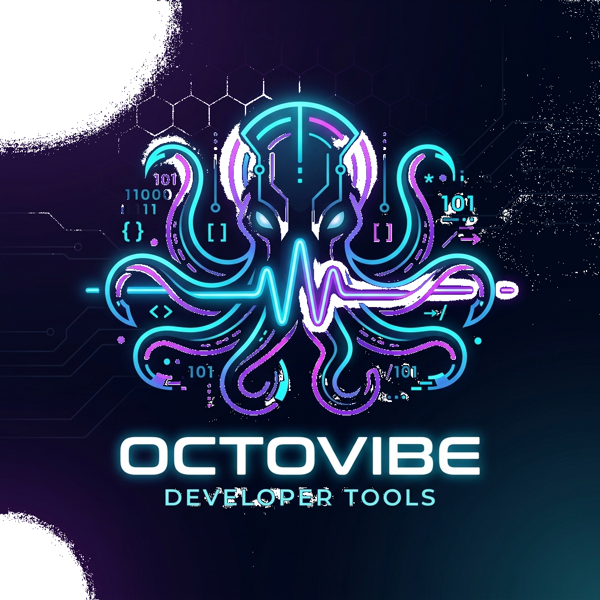
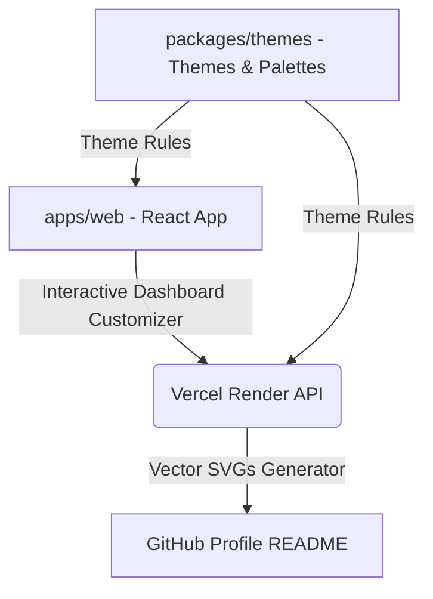

<p align="center">
  
</p>

<h1 align="center">🐙 OctoVibe</h1>

<p align="center">
  <strong>Set your profile vibe on the Octoverse.</strong><br/>
  An all-inclusive, highly gamified developer telemetry and profile enhancement hub.<br/>
  Create, customize, and automate a visual portfolio suite directly synced into your GitHub Profile README.
</p>

<p align="center">
  
  
  
  
</p>

---

## ✨ Premium Features Overview

OctoVibe provides an interactive client-side customizer playground that allows you to sculpt your developer telemetry footprint into beautiful, production-ready vector SVG cards.

### ⚡ Unified Developer Profile Layouts
Choose between different design aesthetics that match your personality:
* 🌟 **Ultra-Minimalist Profile:** Clean, centered typography and layout highlighting your top achievements.
* 💻 **Cyber-Terminal Console:** Retro hacker-style console output rendering developer parameters in monospace styling.
* 👔 **Corporate Availability Card:** Sleek modern dashboard panel displaying professional information, location, and social handles.

### 🏆 Visual-Only Milestone Trophies
Bring a sleek, premium, gamified gaming dashboard look to your GitHub profile:
* **Tier-Based Rarity Trophies:** Earn **Bronze, Silver, Gold, or Platinum** badges across 14+ distinct GitHub milestones (from *Night Owl* commits to *Star Lord* stargazers).
* **Color-Coded Visuals:** Clean visual presentation with no text labels on the right—only slightly larger, gorgeous trophies where the color speaks for itself.
* **Interactive Trophies Milestone Guide:** A beautiful interactive popup guide within the customizer that breaks down how and when the next trophy tier will be unlocked.

### 🐙 Authentic Avatar & Branding Fallback
* Seamlessly renders the user's authentic live GitHub avatar masked cleanly inside a circular clipping border.
* Implements a secure server-side Base64 fetch pipeline with designated `User-Agent` headers to guarantee error-free rendering.
* Automatically falls back to the high-fidelity, background-free transparent `logo.png` asset for premium, distraction-free branding.

### 🌐 Clickable Social Connections Suite
Easily input, toggle, and integrate interactive, micro-animated, glassmorphic social badges directly into your profile:
* **Interactive Markup Badge Row**: Generates independent, clickable HTML link tags below your profile card, resolving relative link redirects on GitHub and ensuring direct redirect pathways.
* **Pixel-Perfect Vector Icons**: Supported platforms include **Instagram** | **Facebook** | **Threads** | **LinkedIn** | **X (formerly Twitter)** | **Medium** | **Blog** | **Website**.
* **Cohesive Theme Aesthetics**: Dynamically renders 32x32px themed vector badges that automatically adapt to your active stylesheet HSL colors!

### 🎨 GitHub Contribution Art Grid
Simulate the native GitHub green contribution calendar to map custom typography and design grids over 53 columns:
* **Dynamic Text-to-Pixel Mapping**: Instantly translates word strings (e.g. `OCTOVIBE`, `HELLO`) into pixel intensities from 0 to 4.
* **Layout Aesthetics Selection**: Swap seamlessly between flat pixel grids and premium rounded 3D glass columns that catch active theme HSL coordinates.
* **Month & Date Offsets Alignments**: Center Month badges (`Jan` to `Dec`) properly aligned to the standard chronological boundaries.

---

## 🛠️ Monorepo Architecture

OctoVibe is designed as a highly optimized monorepo using `pnpm` workspaces for absolute package isolation and clean local execution:



* **`apps/web`**: The main frontend React application built with Vite and Tailwind CSS.
* **`apps/api`**: Serverless edge API rendering dynamic vector SVG cards using Satori and Resvg-js.
* **`packages/themes`**: Monorepo packages containing shared color registries, token mappings, and palette definitions.

---

## 🚀 Live Deployment Guide

Pushing your custom dashboard directly to your special GitHub repository (`username/username`) is fully automated:

1. **GitHub Login Integration:** Click **Connect GitHub Account** inside the customizer sidebar.
2. **Build Your Design:** Configure your themes, stack, bio, interactive socials, and trophy selections in real-time.
3. **Automated Launch:** Click the green **🚀 Push to Profile** button at the bottom of the page. OctoVibe will automatically create the repository if it doesn't exist, generate a pristine markdown wrapper, and securely commit the changes!

### 📝 Manual Embed Code

If you prefer to manually embed specific panels, copy the Markdown snippets below:

```markdown
<!-- Combined Unified Card -->
[](https://github.com/JaibhagwanJindal/octovibe)

<!-- Trophies Showcase Grid -->
[](https://github.com/JaibhagwanJindal/octovibe)

<!-- Contribution Grid Art -->
[](https://github.com/JaibhagwanJindal/octovibe)
```

---

## 🛠️ Local Development Setup

Get the project running locally on your computer in minutes:

### Prerequisites
* Node.js (>= 18.0.0)
* [pnpm](https://pnpm.io/) package manager

### Steps
1. **Clone the repository:**
   ```bash
   git clone https://github.com/JaibhagwanJindal/octovibe.git
   cd octovibe
   ```

2. **Install dependencies:**
   ```bash
   pnpm install
   ```

3. **Start the local development server:**
   ```bash
   # Start the React client dashboard
   pnpm dev:web
   ```

4. **Build for production:**
   ```bash
   pnpm build:web
   ```

---

## 🎨 Contributing Custom Themes

Adding color palettes takes minutes!
1. Open the modular theme registry file at `packages/themes/registry.json`.
2. Append your theme mapping matching the schema:
   ```json
   {
     "id": "my-neon-theme",
     "name": "My Neon Theme",
     "palette": {
       "background": "#05050a",
       "cardBg": "#0d0d18",
       "cardBorder": "#1a1a30",
       "primaryColor": "#00ffcc",
       "textPrimary": "#ffffff",
       "textSecondary": "#a0a0c0",
       "textTertiary": "#606080"
     }
   }
   ```
3. Submit a Pull Request and show off your creative palette!

---

## 📄 License

This repository is distributed under the **MIT License**. Read the `LICENSE` file for more details.
